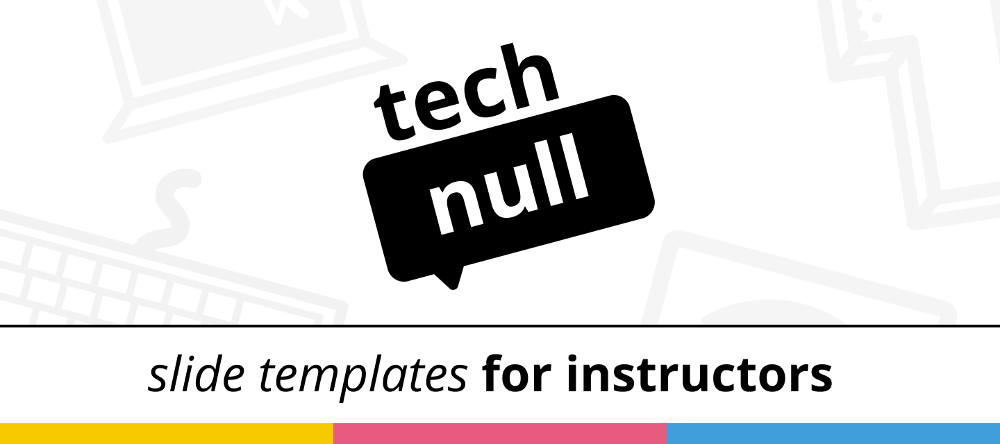

# slide-template

> Master template for slides in reveal.js

## Description

This is the repository to build slides with reveal.js for the `tech-0` course. This repository contains all the template files and assets you need for making slides for `tech-0`.

_Why reveal.js instead of 'insert presentation software here?'_ Mainly because of the live embeds so you can live code demo straight from the slides, the fantastic code support that other presentation software lack, showing interactivity without screen recording and the content-first approach. You can write markdown and don't care about alignment or styling since the template takes care of all that.

## Features

- Uses a custom `tech-0` theme that's easily themeable
- Settings to write external markdown instead of writing your text inline
- Glitch embeds to immediately code away and live demo
- Includes pattern and background assets

## Commands

- Hit `s` on your keyboard for speaker view.
- Hit `f` on your keyboard for fullscreen mode.
- Hit `esc` on your keyboard for overview view.

## Install

1. Install Node.js (10.0.0 or later)
2. Clone this repository and `cd`
3. Install dependencies with `npm install`
4. Run `npm start`

## Programme

This course is given at [Communication and Multimedia Design][bachelor], a
design bachelor focused on interactive digital products and services. CMD is
part of the [Faculty of Digital Media and Creative Industries][faculty] at the
[Amsterdam University of Applied Sciences][university].

## Conduct

This course has a [Code of Conduct][coc]. Anyone interacting with this repository, organisation, or community is bound by it.

Staff and students of the Amsterdam University of Applied Sciences (Hogeschool
van Amsterdam) are additionally bound by the [Regulation Undesirable
Conduct][ruc] ([Regeling Ongewenst Gedrag][rog]).

## License

[MIT][] © [Danny de Vries][dangit] and AUAS, docs and images are [CC-BY-4.0][].

[cmd]: https://www.cmd-amsterdam.nl/english/
[cmda]: https://github.com/cmda
[bachelor]: https://www.cmd-amsterdam.nl/english/
[faculty]: https://www.amsterdamuas.com/faculty/fdmci/faculty-of-digital-media-and-creative-industries.html
[university]: https://www.amsterdamuas.com
[coc]: code-of-conduct.md
[ruc]: https://www.amsterdamuas.com/practical-matters/algemeen/hva-breed/juridische-zaken/legal-affairs/regulation-undesirable-conduct/regulation-undesirable-conduct.html#anker-3-complaints-authority
[rog]: https://www.hva.nl/praktisch/algemeen/hva-breed/juridische-zaken/loket-beroep-bezwaar-en-klacht/regeling-ongewenst-gedrag/regeling-ongewenst-gedrag.html?origin=gbS4rg%2FDTZuxQ6lGVF%2BN1A
[author]: https://dandevri.es
[mit]: license.md#code
[cc-by-4.0]: license.md#documentation-and-images
[dangit]: https://github.com/dandevri
